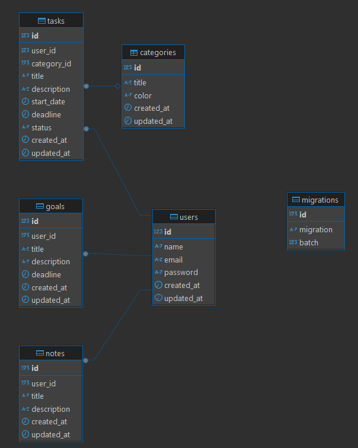
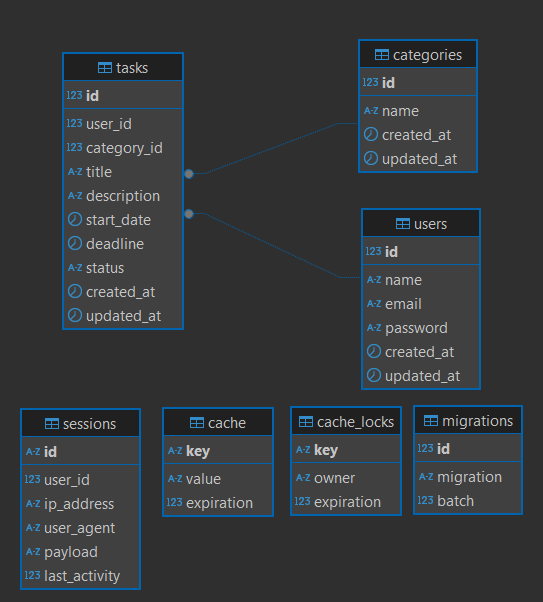

# SUSU-Fullstack

## Как выглядит схема базы данных к домашней работе "Создать модели и миграции"
### Работа находится в каталоге Course-Fullstack-2st-year/Server-side_development/MyTestBackend

## Как выглядит схема базы данных к домашней работе "Работа данными (CRUD контроллеры и шаблоны)"
### Работа находится в каталоге Course-Fullstack-2st-year/Server-side_development/MainTestFB
### Реализовано регистрация/входа пользователя на сайт, кроме этого, удаление и редактирование пользователя.
### Также есть возможность создание карточки-задачника, который пользователь сам создает при помощи кнопки, к сожалению, есть недочеты.
### Я не выяснил причину того, почему возникают ошибки при удалении и редактировании карточки - нужна доработка.
